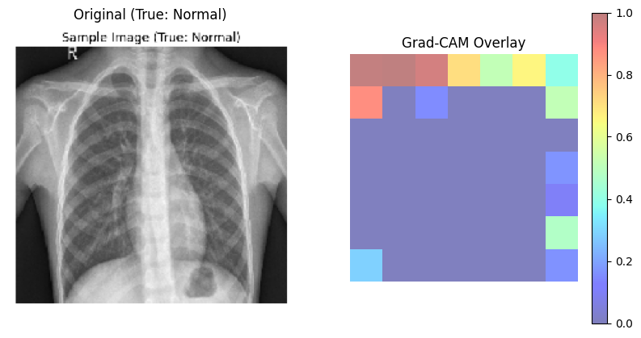

# 🩺 Pneumonia Detection from Chest X-rays using Deep Learning (MobileNetV2 + Grad-CAM)

This project detects Pneumonia in chest X-ray images using a deep learning model built with MobileNetV2 and TensorFlow. 
It includes Grad-CAM visualizations to explain how the model makes predictions.

---

## 📌 Project Overview

- **Model**: Transfer Learning with MobileNetV2
- **Dataset**: Chest X-ray images (Normal vs Pneumonia)
- **Frameworks**: TensorFlow / Keras, Google Colab
- **Key Features**:
  - Binary classification (Normal / Pneumonia)
  - Grad-CAM visual explanation
  - Confusion matrix and classification report

---

## 📁 Dataset

The dataset is structured into:
- `/train`
- `/val`
- `/test`

Each folder contains subfolders for `NORMAL` and `PNEUMONIA` classes.

---

## 🧠 Model Summary

- Pretrained base: MobileNetV2 (`imagenet`)
- Layers:
  - GlobalAveragePooling2D
  - Dropout
  - Dense (256, ReLU)
  - Output: Dense (1, Sigmoid)

---

## 🧪 Evaluation

- **Loss**: Binary Crossentropy
- **Metrics**: Accuracy, AUC
- **Evaluation Tools**:
  - Classification Report
  - Confusion Matrix
  - Grad-CAM heatmap

---

## 🔍 Grad-CAM Visualization

This project uses Grad-CAM to highlight regions of X-rays where the model focused most when predicting "Pneumonia".

---

## 💡 Future Improvements

- Fine-tune more layers of the base model
- Improve accuracy and reduce false negatives
- Add a web UI using Streamlit

---

## 📷 Example Grad-CAM Output

---

## 📜 License

This project is for educational purposes only. Not for clinical use.
